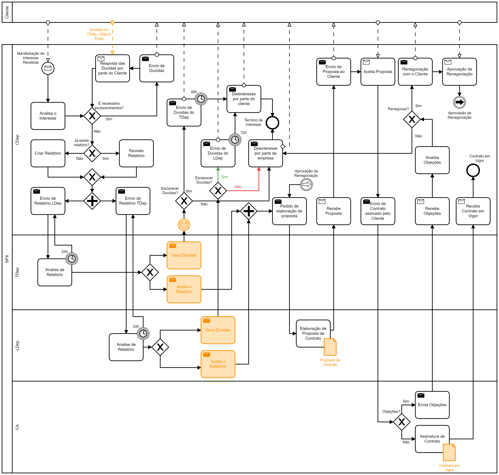
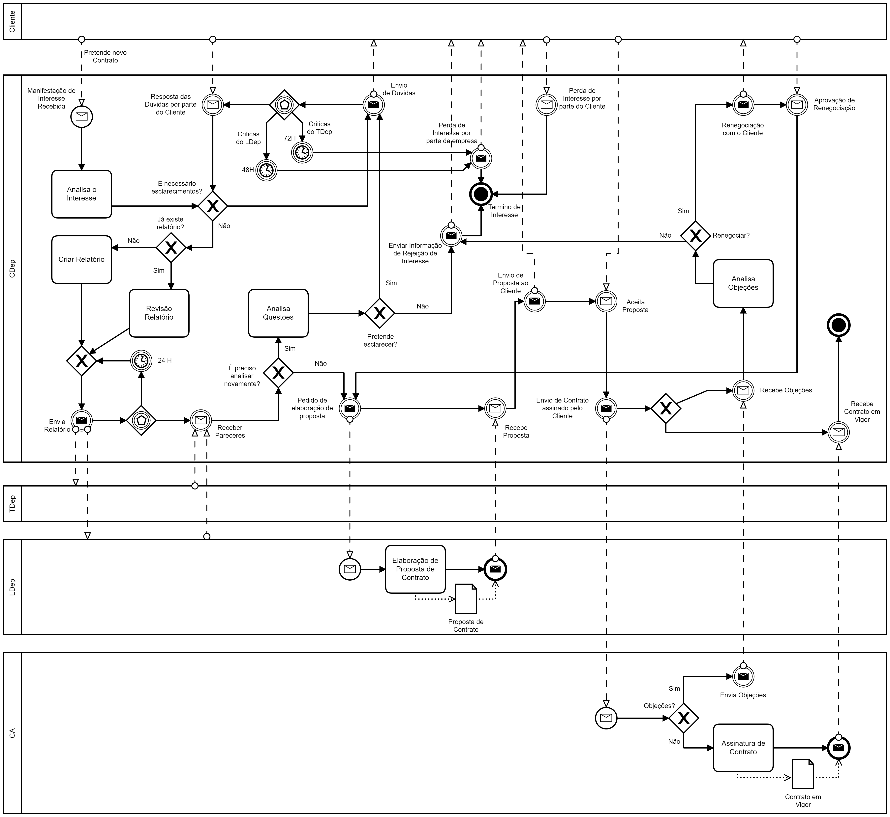

# AMS_20-21 - Project02

**Diagramas a realizar:**

* [#1](#bpmn---processo-de-proposta-a-um-pedido-e-de-celebração-de-contrato) - `BPMN` - Processo de proposta a um pedido e de celebração de contrato;

* [#2]() - `BPMN` - Processo de intervenção numa estação;

* [#3]() - `UML` - Casos de uso da Aplicação *Satis*;

* [#4]() - `Lingua Natural` - Descrição estruturada.

## BPMN - Processo de proposta a um pedido e de celebração de contrato

#### Dúvidas

​	**Q:** Qual a melhor abordagem (segundo as abordagens que temos)?

​	**A:** (...)

---

​	**Q:** Qual a diferença entre `Evento de envio` e `Tarefa de envio`?

​	**A:** O evento não pertence a ninguém, ou seja o enviar mensagem não tem nenhuma atividade por trás. A tarefa de enviar mensagem já indica que há um trabalho por trás antes de enviar. Por exemplo escrever um mail para a professora a dizer que queria ir ao horário de dúvidas: tarefa porque tive de elaborar e escrever o mail. Se fosse uma cena automática de enviar já era um evento.

---

#### Resoluções

| Resolução                    | Resolução Alternativa              |
| ---------------------------- | ---------------------------------- |
|  |  |
